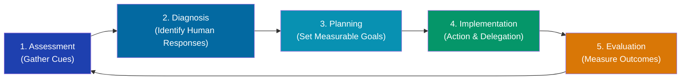
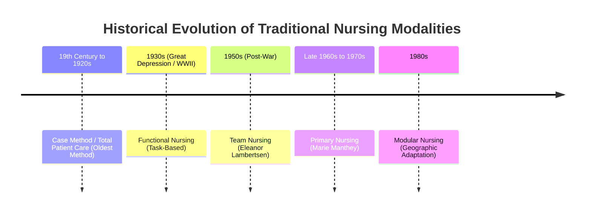
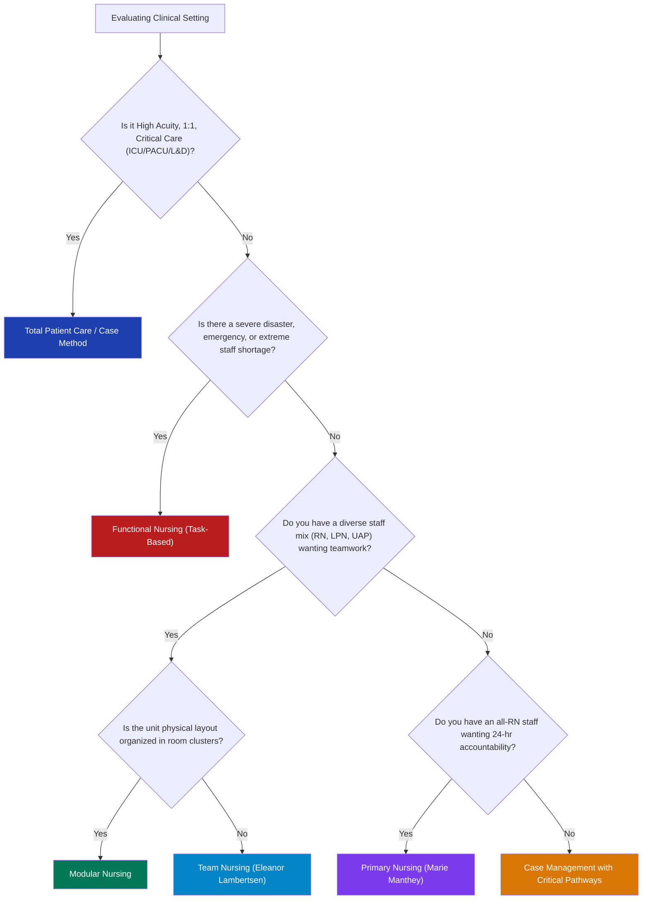

# NCM 119: Nursing Leadership and Management
## Module 2: Nursing Care Delivery Systems (NCDS)
### Comprehensive Study Lesson for 4th-Year Nursing Students

---

## Welcome & Pedagogical Orientation

As a 4th-year nursing student preparing for graduation, your clinical leadership rotations, and the licensure examination (such as the Philippine Nursing Licensure Examination [PNLE] or the National Council Licensure Examination for Registered Nurses [NCLEX-RN]), **Nursing Care Delivery Systems** is one of the most critical topics in **NCM 119 (Nursing Leadership and Management)**.

Even if you have never encountered this module before, this study lesson will take you step-by-step from core fundamentals to advanced leadership applications. 

> [!IMPORTANT]
> **Core Concept**: A **Nursing Care Delivery System (NCDS)** or **Patient Care Delivery System (PCDS)** is the structural framework, organization, and philosophy by which nursing care is coordinated, delegated, and delivered to patients. It determines **who does what**, **who makes clinical decisions**, and **who is accountable** for patient outcomes.

---

## Master Abbreviation & Acronym Reference Table

Every abbreviation used in this module and licensure examinations is expanded below. Bookmark this section for quick reference:

| Abbreviation | Full Terminology | Clinical & Managerial Context |
| :--- | :--- | :--- |
| **NCDS / PCDS** | **Nursing Care Delivery System / Patient Care Delivery System** | The structural framework and method of organizing and delivering nursing care. |
| **NCM** | **Nursing Care Management** | Academic curriculum designation for nursing specialty coursework (e.g., NCM 119). |
| **ADPIE** | **Assessment, Diagnosis, Planning, Implementation, Evaluation** | The five cyclic phases of the scientific Nursing Process. |
| **EBP** | **Evidence-Based Practice** | Clinical decision-making integrating best research evidence, clinical expertise, and patient values. |
| **PCS** | **Patient Classification System** | An objective measurement tool grouping patients by acuity and dependency to guide staffing. |
| **TPC** | **Total Patient Care (Case Method)** | Care model where one registered nurse assumes full care for assigned patients during a shift. |
| **RN** | **Registered Nurse** | A licensed healthcare professional responsible for holistic assessment, nursing diagnosis, care planning, complex interventions, and evaluation. |
| **LPN / LVN** | **Licensed Practical Nurse / Licensed Vocational Nurse** | Technical healthcare nurse practicing under RN supervision; handles stable patients, routine oral medications, and dressings. |
| **UAP / NA** | **Unlicensed Assistive Personnel / Nursing Aide (or Assistant)** | Non-licensed staff trained to assist with basic activities of daily living (ADLs), vital signs, hygiene, and stocking. |
| **ADL** | **Activities of Daily Living** | Routine daily self-care tasks (bathing, dressing, grooming, eating, ambulating, toileting). |
| **LOS** | **Length of Stay** | Total number of calendar days a patient occupies an inpatient hospital bed. |
| **DRG** | **Diagnosis-Related Group** | A prospective payment classification system standardizing Medicare/insurance hospital reimbursement. |
| **CQI / TQM** | **Continuous Quality Improvement / Total Quality Management** | Systematic institutional management philosophies aimed at ongoing process improvements and patient safety. |
| **ICU / CCU** | **Intensive Care Unit / Critical Care Unit** | Specialized critical care units utilizing 1:1 or 1:2 Total Patient Care staffing. |
| **PACU** | **Post-Anesthesia Care Unit** | Specialized recovery room following surgery utilizing high-acuity one-on-one nursing care. |
| **OR** | **Operating Room** | Surgical suite utilizing dedicated scrub and circulating functional or case-method roles. |
| **PO** | ***Per Os* (By Mouth)** | Medical abbreviation indicating oral route of medication administration. |
| **IV** | **Intravenous** | Administration of fluids, electrolytes, blood, or medications directly into a vein. |
| **PRN** | ***Pro Re Nata*** | As needed / according to clinical circumstances. |
| **NCP** | **Nursing Care Plan** | Formal written or electronic documentation of the nursing process for an individualized patient. |
| **FTE** | **Full-Time Equivalent** | Human resource staffing metric equal to 40 hours per week of employee labor. |
| **CM** | **Case Management / Case Manager** | Collaborative care model managing patient trajectories across acute and post-acute settings. |
| **CP / CMM** | **Critical Pathway / Clinical Multidisciplinary Matrix** | Structured timeline-based interdisciplinary care protocols mapping daily milestones. |

---

## Unit 1: Foundations of Nursing Care Delivery & The Nursing Process

### 1.1 What is a Patient Care Delivery System (PCDS)?
A **Patient Care Delivery System** refers to the method, organizational structure, and allocation of human resources by which nursing care is organized, coordinated, and provided to patients in healthcare settings.

Every hospital or clinical unit must adopt a delivery model based on four institutional pillars:
1. **Patient Population & Acuity**: How sick are the patients? What are their dependency needs?
2. **Staff Mix & Qualifications**: What proportion of the nursing workforce consists of Registered Nurses (RNs), Licensed Practical Nurses (LPNs/LVNs), and Unlicensed Assistive Personnel (UAPs)?
3. **Economic & Physical Resources**: What is the hospital budget, supply chain, and physical architectural floor plan?
4. **Organizational Philosophy**: Does the hospital prioritize cost efficiency, task speed, nurse autonomy, or holistic continuity of care?

### 1.2 The Nursing Process as the Foundation of Delivery
In **1958, Ida Jean Orlando** formulated the **Dynamic Nurse-Patient Relationship**, formalizing the **Nursing Process** that remains the operational cornerstone of modern nursing.

The nursing process is a systematic, client-centered, scientific problem-solving approach integrating:
* **Critical Thinking**: Analyzing cues, recognizing patterns, and prioritizing clinical problems.
* **Evidence-Based Practice (EBP)**: Basing interventions on validated clinical research rather than tradition.
* **Goal-Oriented Outcomes**: Setting measurable, time-bound targets for client recovery.
* **Clinical Intuition**: Synthesizing deep knowledge, clinical exposure, and holistic awareness.



#### The Five Cyclic Phases (ADPIE) in Leadership:
1. **Assessment (A)**: Systematic collection of subjective (client statements) and objective data (vital signs, physical exam, laboratory diagnostics). *Managerial note: High-acuity assessment cannot be delegated to assistive personnel.*
2. **Diagnosis (D)**: Clinical judgment regarding human response to actual or potential health problems or life processes.
3. **Planning (P)**: Formulating individualized Nursing Care Plans (NCPs), establishing priorities using Maslow’s Hierarchy of Needs and ABCs (Airway, Breathing, Circulation), and outlining realistic expected patient outcomes.
4. **Implementation (I)**: Executing direct nursing interventions, providing patient education, performing clinical treatments, and delegating tasks according to staff scope of practice.
5. **Evaluation (E)**: Continual reassessment to determine if predetermined patient goals were met, partially met, or unmet, modifying the care plan accordingly.

---

## Unit 2: Patient Classification Systems (PCS) & Workload Balancing

### 2.1 Definition & Purpose
A **Patient Classification System (PCS)** is an objective, standardized management tool used to categorize patients according to their assessed care requirements and nursing dependency over a specific time period (usually a 24-hour shift cycle).

> [!NOTE]
> **Why PCS matters to a Nurse Manager**: Bed count alone does **not** reflect nursing workload. Twenty post-operative cardiac bypass patients require radically more nursing hours than twenty stable ambulatory medical patients. PCS provides the mathematical and clinical justification to match nurse staffing to true patient workload.

### 2.2 Core Classification Criteria
A comprehensive PCS evaluates four clinical dimensions:
1. **Acuity Level**: The physiological severity, instability, and urgency of the patient’s condition (e.g., hemodynamically unstable shock vs. stable post-appendectomy day 2).
2. **Dependency on Care**: The degree of physical assistance required to complete Activities of Daily Living (ADLs) such as bathing, toileting, repositioning, and feeding.
3. **Complexity of Treatment & Procedures**: The volume, frequency, and difficulty of technical medical orders (e.g., continuous IV vasoactive infusions, arterial line monitoring, complex wound dressings, total parenteral nutrition [TPN], tracheostomy suctioning).
4. **Emotional & Psychological Support Needs**: The emotional state, family distress, delirium, health literacy barriers, and counseling requirements of the patient and family.

### 2.3 Management Value of PCS
* **Evidence-Based Staffing Ratios**: Prevents arbitrary or dangerous nurse-to-patient ratios.
* **Equitable Workload Distribution**: Eliminates nurse burnout by preventing one nurse from receiving all heavy, high-acuity patients while another receives low-acuity patients.
* **Budgetary & Resource Allocation**: Justifies Full-Time Equivalent (FTE) budget requests to hospital administration based on documented Nursing Hours Per Patient Day (NHPPD).
* **Enhanced Patient Safety**: Directly correlates with reduced medication errors, hospital-acquired pressure injuries (HAPIs), catheter-associated urinary tract infections (CAUTIs), and patient fall rates.

---

## Unit 3: Traditional Care Delivery Modalities

Historically, nursing care delivery evolved across the 20th century in response to social crises, economic depressions, wars, and nurse staffing shortages. The traditional modalities comprise five distinct systems:



---

### 3.1 Case Method (Total Patient Care - TPC)

#### Overview & Structure
The **Case Method** is the **oldest method of nursing care delivery**. In early nursing history (19th and early 20th centuries), nurses worked primarily in private duty, living in private homes or caring for one patient in a hospital room. 

In modern hospital practice, it is known as **Total Patient Care (TPC)**. Under this model, the **Registered Nurse (RN)** is assigned total responsibility for all care needed by one or more patients for the duration of a **single 8-hour or 12-hour shift**.

```
[ Registered Nurse (RN) ] ───────────────> [ Assigned Patient(s) ]
(Assumes 100% of Care: Medications, Baths, Assessments, Treatments, Documentation)
```

#### Key Characteristics:
* The nurse on duty plans, organizes, and delivers all care directly during that shift.
* No delegation of basic care to aides or technical nurses; the RN performs everything from bed baths to titration of vasopressors.
* Modern deployment: Intensive Care Units (ICU), Post-Anesthesia Care Units (PACU), Cardiac Catheterization Recovery, and Labor & Delivery (L&D) suites.

#### Merits (Advantages):
1. **Holistic & Comprehensive Care**: The nurse observes subtle changes in physical, emotional, and social status during unfragmented bedside interaction.
2. **Clear Accountability for the Shift**: If a medication is delayed, a vital sign missed, or a treatment omitted, responsibility rests solely on that one assigned nurse.
3. **High Patient Satisfaction**: Patients enjoy knowing exactly who their nurse is without a parade of different staff members entering the room.
4. **High Nurse Autonomy**: Nurses experience professional satisfaction exercising independent clinical judgment.

#### Demerits (Disadvantages):
1. **Highest Cost**: Requires an all-RN or nearly all-RN staffing model, making it the most expensive traditional delivery system.
2. **Vulnerability to RN Shortages**: When qualified RNs are scarce, TPC becomes unsustainable.
3. **Shift-by-Shift Fragmentation**: While continuity is high *within* a shift, care can become disjointed over a 5-day admission if a different RN is assigned each day with differing care philosophies.

---

### 3.2 Functional Nursing

#### Overview & Structure
Developed in the **1930s in the United States** during the Great Depression and World War II, hospitals faced severe registered nurse shortages combined with an influx of unlicensed assistants and practical nurses. 

To cope, nursing borrowed industrial efficiency principles from Henry Ford’s assembly lines: **the work was divided by task rather than by patient**.

```
                           [ Nurse Manager / Head Nurse ]
                                        │
     ┌──────────────────────┬───────────┴───────────┬──────────────────────┐
     │                      │                       │                      │
[ LPN / LVN ]             [ RN ]              [ Nurse Aide 1 ]       [ Nurse Aide 2 ]
(PO Meds & Treatments)  (Assessments/NCPs)  (Vital Signs & Baths)  (Linens & Stocking)
     │                      │                       │                      │
     └──────────────────────┴───────────┬───────────┴──────────────────────┘
                                        │
                               [ Assigned Patients ]
```

#### Key Characteristics:
* Staff members are assigned specific technical functions for **all** patients on the unit:
  * One nurse is the **Medication Nurse** (administers all medications to 30 patients).
  * One nurse is the **Treatment Nurse** (performs all wound dressings, catheterizations, and tube care).
  * The RN acts as the **Assessment/Charge Nurse** (writes care plans, receives physician orders).
  * Nursing aides perform all vital signs, bed baths, or linen changes.

#### Merits (Advantages):
1. **High Operational Efficiency**: Assembly-line speed; staff become exceptionally fast and skilled at their single repetitive task.
2. **Cost-Effective**: Allows a hospital to run safely with a skeleton crew of few RNs combined with a large ratio of lower-wage assistive personnel (LPNs/UAPs).
3. **Easy Supervision in Emergencies**: During mass casualties, disasters, or military field operations, functional nursing enables rapid processing of huge patient volumes.

#### Demerits (Disadvantages):
1. **Severe Fragmentation of Care**: The patient is viewed as a collection of disjointed tasks rather than an integrated human being.
2. **Diminished Continuity of Care**: No single clinician sees the whole picture; an adverse drug effect observed by the aide may never be connected to the medication administered by the LPN.
3. **Patient Insecurity & Anxiety**: Patients cannot identify "their nurse" because five different individuals enter their room to perform separate tasks.
4. **Monotony & Low Job Satisfaction**: Staff experience burnout from repetitive, mechanized work with little sense of clinical completion.
5. **Difficulty Establishing Priorities**: When an emergency arises, everyone assumes someone else is monitoring the overall patient.

---

### 3.3 Team Nursing

#### Overview & Structure
Introduced in the **1950s** by **Eleanor Lambertsen**, Team Nursing was designed to overcome the impersonal fragmentation of Functional Nursing while continuing to utilize a diverse, multi-tiered staff mix (RNs, LPNs, UAPs).

Under Team Nursing, the unit is organized into **teams** led by a qualified **Registered Nurse (Team Leader)**, who directs a multidisciplinary team providing coordinated care to a designated group of patients.

```
                         [ Nurse Manager / Head Nurse ]
                                        │
            ┌───────────────────────────┴───────────────────────────┐
            │                                                       │
   [ RN Team Leader 1 ]                                    [ RN Team Leader 2 ]
            │                                                       │
 ┌──────────┼──────────┐                                 ┌──────────┼──────────┐
 │          │          │                                 │          │          │
[RN]    [LPN/LVN]    [UAP]                              [RN]    [LPN/LVN]    [UAP]
 └──────────┬──────────┘                                 └──────────┬──────────┘
            │                                                       │
  [ Patient Group A ]                                     [ Patient Group B ]
```

#### Key Characteristics:
1. **The RN Team Leader**: Must possess strong leadership, clinical decision-making, and communication skills. The leader assigns duties matching team members' licensed scopes and individual competencies.
2. **Team Conferences (Pre- and Post-Conferences)**: Essential daily meetings where the team discusses care plans, solves clinical challenges, and evaluates patient progress.
3. **Shared Responsibility**: All team members collaborate under the direct supervision of the team leader.

#### Merits (Advantages):
1. **Collaborative Synergy**: Combines the clinical expertise of the RN with the technical skills of LPNs and aides.
2. **High Staff Morale & Teamwork**: Democratic leadership style fosters mutual respect, open communication, and shared problem-solving.
3. **Comprehensive Utilization of Nursing Process**: The team leader coordinates the holistic plan of care while delegating appropriate sub-tasks.
4. **Cost-Effective Quality**: Provides higher patient satisfaction than functional nursing without requiring the extreme staffing expense of total patient care.

#### Demerits (Disadvantages):
1. **Heavy Dependence on Leadership Skill**: If the RN Team Leader has weak delegation or communication skills, the model quickly degenerates into disorganized Functional Nursing.
2. **Time Consuming**: Team conferences, coordination, and constant status updates consume substantial shift time.
3. **Blurred Accountability**: When errors occur, team members may point fingers, making individual accountability harder to isolate than in Total Patient Care.

---

### 3.4 Modular Nursing (District Nursing)

#### Overview & Structure
Developed in the **1980s by Magargal and colleagues**, **Modular Nursing** is a direct geographical modification of Team Nursing.

In traditional Team Nursing, team members often run back and forth across a large, sprawling 40-bed hospital unit. Modular Nursing solves this logistical inefficiency by **dividing the physical floor plan into geographic clusters or "modules"** (e.g., Module 1 = Rooms 101 to 108; Module 2 = Rooms 109 to 116).

```
                                [ Nurse Manager ]
                                        │
     ┌──────────────────────────────────┼──────────────────────────────────┐
     │                                  │                                  │
[ Geographic Module 1 ]        [ Geographic Module 2 ]        [ Geographic Module 3 ]
(Rooms 101 - 108)              (Rooms 109 - 116)              (Rooms 117 - 124)
  • Dedicated RN                 • Dedicated RN                 • Dedicated RN
  • Dedicated LPN                • Dedicated LPN                • Dedicated LPN
  • Dedicated Aide               • Dedicated Aide               • Dedicated Aide
  • Dedicated Med Cart           • Dedicated Med Cart           • Dedicated Med Cart
  • Dedicated Linen Supply       • Dedicated Linen Supply       • Dedicated Linen Supply
```

#### Key Characteristics:
* A consistent, smaller mini-team (typically 1 RN paired with 1 LPN or 1 UAP) is assigned permanently to a specific geographic cluster of rooms.
* Decentralized nursing stations: Medications, linens, diagnostic equipment, and charting terminals are stationed physically within the module rather than in one distant central nurses' station.

#### Merits (Advantages):
1. **Dramatically Reduces Walking & Transit Time**: Nurses spend less time walking down long hallways, maximizing direct bedside care hours.
2. **Closer Patient Observation**: Because the nurse is physically located right outside the cluster of rooms, response time to call lights is rapid.
3. **Stronger Continuity in Micro-Teams**: Small pairing (RN + UAP) fosters tight collaboration and mutual trust.

#### Demerits (Disadvantages):
1. **Architectural Constraints**: Units with traditional long, single-hallway layouts cannot easily implement modules without physical renovations.
2. **Potential Team Isolation (Silo Effect)**: Nurses in Module 1 may be overwhelmed during a code or crisis while nurses in Module 3 are unaware and cannot assist unless communication protocols are rigorous.

---

### 3.5 Primary Nursing

#### Overview & Structure
Conceived in the **late 1960s** at the University of Minnesota Hospitals by **Marie Manthey**, Primary Nursing represents the pinnacle of professionalized, decentralized registered nurse accountability.

Under Primary Nursing, a **single Registered Nurse (the Primary Nurse)** assumes **24-hour total accountability** for planning, coordinating, and evaluating the individualized care of a patient **from admission through discharge**.

```
                   ┌────────────────────────────────────────┐
                   │             Primary Nurse              │
                   │ (24-Hour Responsibility for Assessment,│
                   │    Planning, Directing, & Evaluation)  │
                   └───────────────────┬────────────────────┘
                                       │
            ┌──────────────────────────┼──────────────────────────┐
            │                          │                          │
            ▼                          ▼                          ▼
   [ Associate Nurse ]            [ Patient ]           [ Multidisciplinary Team ]
(Delivers care on off-shifts;                           (Physicians, PT, OT, Dietary,
follows Primary Nurse's NCP)                             communicates with Primary Nurse)
```

#### Key Characteristics:
1. **24-Hour Accountability**: Even when the Primary Nurse is off duty (sleeping at home or on days off), their written Nursing Care Plan (NCP) governs the patient's care.
2. **The Associate Nurse (Secondary Nurse)**: When the Primary Nurse is off-duty, an Associate Nurse delivers direct care by following the established care plan. The Associate Nurse only makes significant care plan changes in consultation with the Primary Nurse or charge nurse if clinical conditions change drastically.
3. **Direct Patient-Provider Line**: The Primary Nurse communicates directly with the attending physician and allied healthcare team members, eliminating go-betweens.

#### Merits (Advantages):
1. **Highest Continuity of Care**: The patient and family have one dedicated clinical advocate who knows every detail of their case.
2. **Unrivaled Patient and Family Satisfaction**: Establishes strong therapeutic nurse-patient rapport and mutual trust.
3. **High Professional Autonomy & Job Fulfillment**: Primary nurses function as fully autonomous clinical managers of their caseload.
4. **Fewer Errors & Shorter Hospital Stays**: Care plans are updated continuously by an expert familiar with the patient's baseline.

#### Demerits (Disadvantages):
1. **High Personnel Costs**: Requires a virtually all-RN staffing model, creating major budgetary challenges.
2. **Stress & Burnout on the Primary Nurse**: 24-hour responsibility can lead to psychological burden and difficulty disconnecting during time off.
3. **Uneven Quality if Nurse is Inexperienced**: Novice nurses or nurses with poor clinical decision-making may struggle with unsupervised total care coordination.
4. **Associate Nurse Dissatisfaction**: Associate nurses may feel their role is reduced to mechanical execution of someone else's care plan.

---

## Unit 4: Advanced & Contemporary Care Delivery Modalities

In response to modern healthcare economic pressures (managed care, capitation, diagnostic-related groups [DRGs], and rising healthcare costs), nursing leadership developed advanced multidisciplinary models focusing on **system-wide care coordination across entire episodes of illness**.

---

### 4.1 Case Management

#### Overview & Definition
**Nursing Case Management** is a collaborative, interdisciplinary healthcare delivery strategy that assesses, plans, implements, coordinates, monitors, and evaluates patient care options and services across an **entire episode of illness** (from pre-admission through acute inpatient stay to discharge, rehabilitation, home care, or hospice).

```
[ Onset of Illness ]
        │
        ▼
┌────────────────────────────────────────────────────────────────────────┐
│                        NURSE CASE MANAGER                              │
│   Assesses, plans, implements, monitors, and coordinates care options  │
└───────┬──────────────────────────┬─────────────────────────────┬───────┘
        │                          │                             │
        ▼                          ▼                             ▼
[ Patient & Family ]   [ Interprofessional Team ]      [ Post-Acute Services ]
• Holistic counseling   • Physicians                    • Home Health Care
• Shared goal-setting   • Physical/Speech/OT            • Hospice Care
• Advocacy              • Clinical Nutrition/Dietary    • Skilled Nursing Facility
• Discharge readiness   • Social Work & Finance         • Ambulatory Care Clinics
        │                          │                             │
        └──────────────────────────┴─────────────────────────────┘
                                   │
                                   ▼
                         [ Resolution of Illness ]
```

#### The Nurse Case Manager Role:
* Unlike bedside clinical nurses who provide shift-based hands-on care, the **Nurse Case Manager (CM)** is a systems-level coordinator.
* The Case Manager tracks high-risk, high-cost, or chronically ill patient populations (e.g., congestive heart failure, stroke, brittle diabetes, major trauma, total joint arthroplasty).
* Coordinates with insurance companies (payers) to ensure necessary authorizations, avoid denials, and optimize resource utilization.

#### Advantages of Case Management:
* **For the Patient**:
  * Standardized clinical outcomes and high-quality care.
  * Facilitates timely, safe, and expedited discharge (reducing unnecessary bed days).
  * Promotes seamless transitions between hospital, home, and rehabilitation without gaps in care.
  * Conserves client financial resources by preventing duplicative tests and procedures.
* **For the Healthcare Team & Nurse**:
  * Enhances interprofessional communication, teamwork, and clinical collaboration.
  * Provides professional autonomy and advanced practice leadership opportunities.
  * Facilitates clinical knowledge transfer from expert case managers to novice bedside staff.

#### Disadvantages / Managerial Challenges:
* **Expensive Initial Implementation**: Requires hiring experienced, master’s-prepared or certified case management nurses.
* **Lack of Administrative Support**: If hospital executives treat case management merely as a cost-cutting tool rather than a clinical quality advocacy role, friction emerges between administrators, physicians, and nurses.
* **Role Ambiguity**: Bedside nurses may mistake the Case Manager for a discharge planner, leading to turf battles unless roles are clearly delineated.

---

### 4.2 Critical Pathways (Clinical Pathways / Care Maps)

#### Overview & Definition
**Critical Pathways** (also called **Clinical Pathways**, **Care Maps**, or **Integrated Care Pathways**) are structured, multidisciplinary management tools designed to outline the optimal sequence, timing, and nature of interventions by all healthcare team members for a specific clinical diagnosis or surgical procedure.

Critical pathways operationalize Case Management. If Case Management is the **strategy**, Critical Pathways are the **blueprint**.

```
Diagnosis: Elective Total Hip Arthroplasty (THA) - Clinical Pathway Sample Grid
┌───────────────┬─────────────────────────┬─────────────────────────┬─────────────────────────┐
│ Timeline      │ Pre-Operative (Day 0)   │ Post-Operative (Day 1)  │ Post-Operative (Day 2)  │
├───────────────┼─────────────────────────┼─────────────────────────┼─────────────────────────┤
│ Assessment    │ Pre-op baseline, labs   │ Incision check, vitals  │ Readiness for discharge │
├───────────────┼─────────────────────────┼─────────────────────────┼─────────────────────────┤
│ Medications   │ Prophylactic IV Cefazolin│ Stepdown oral analgesics│ Oral pain meds, LMWH    │
├───────────────┼─────────────────────────┼─────────────────────────┼─────────────────────────┤
│ Activity / PT │ Education on crutches   │ Out of bed to chair     │ Ambulating 50 ft        │
├───────────────┼─────────────────────────┼─────────────────────────┼─────────────────────────┤
│ Nutrition     │ NPO past midnight       │ Clear liquids to regular│ Full regular diet       │
├───────────────┼─────────────────────────┼─────────────────────────┼─────────────────────────┤
│ Discharge Plan│ Confirm home support    │ Physical therapy review │ Discharge home with PT  │
└───────────────┴─────────────────────────┴─────────────────────────┴─────────────────────────┘
```

#### Core Components of a Critical Pathway:
1. **Timeline Benchmarks**: Explicit daily or hourly milestones indicating where the patient should be physiologically.
2. **Multidisciplinary Interventions**: Directives for nursing, medicine, physical therapy (PT), occupational therapy (OT), respiratory therapy (RT), dietary, and pharmacy.
3. **Target Expected Outcomes**: Specific measurable criteria required before advancing to the next phase (e.g., "Tolerating oral fluids; pain managed at ≤ 3/10; ambulating to bathroom with walker").
4. **Variance Tracking (CRITICAL NURSING CONCEPT)**:
   * **Variance**: Any event, clinical finding, or delay that causes a patient to deviate from the established critical pathway timeline.
   * **Positive Variance**: Patient achieves a milestone earlier than projected (e.g., extubated 4 hours ahead of schedule).
   * **Negative Variance**: Patient fails to meet a milestone or suffers a complication (e.g., develops a post-op fever of 39°C, unexpected surgical site infection, severe nausea preventing oral intake, or physical therapy delay).
   * **Managerial Action on Variance**: Every negative variance requires **immediate nursing assessment, documentation, provider notification, and root-cause analysis** to prevent extended Length of Stay (LOS).

#### Core Purposes of Critical Pathways:
1. **Organize & Standardize Care**: Eliminates arbitrary physician-to-physician variation in routine management.
2. **Reduce Clinical Delays & Medical Errors**: Keeps the entire healthcare team aligned on day-to-day milestones.
3. **Enhance Patient Outcomes**: Consistent delivery of evidence-based clinical practice bundles.
4. **Control Hospital Costs**: Directly controls Length of Stay (LOS) and resource utilization, maximizing reimbursement under Diagnosis-Related Groups (DRGs).

---

## Unit 5: Synthesis & Decision-Making Framework

To master NCM 119 and score 100% on management exams, you must know how to select the right delivery system for any clinical scenario:



---

## Next Steps in Your Study Plan

You have completed the foundational study lesson! Proceed to the companion artifacts:
* Review **[`quick_notes.md`](file:///C:/Users/Loki/.gemini/antigravity/brain/4078f289-a6f4-4915-9776-4c4209718dfc/quick_notes.md)** for high-yield summary comparison tables and mnemonics.
* Test your understanding with the formative **[`study_quiz.md`](file:///C:/Users/Loki/.gemini/antigravity/brain/4078f289-a6f4-4915-9776-4c4209718dfc/study_quiz.md)**.
* Take the final **[`comprehensive_exam_40_items.md`](file:///C:/Users/Loki/.gemini/antigravity/brain/4078f289-a6f4-4915-9776-4c4209718dfc/comprehensive_exam_40_items.md)** to verify that you meet the target score of **35–40 correct answers**.
